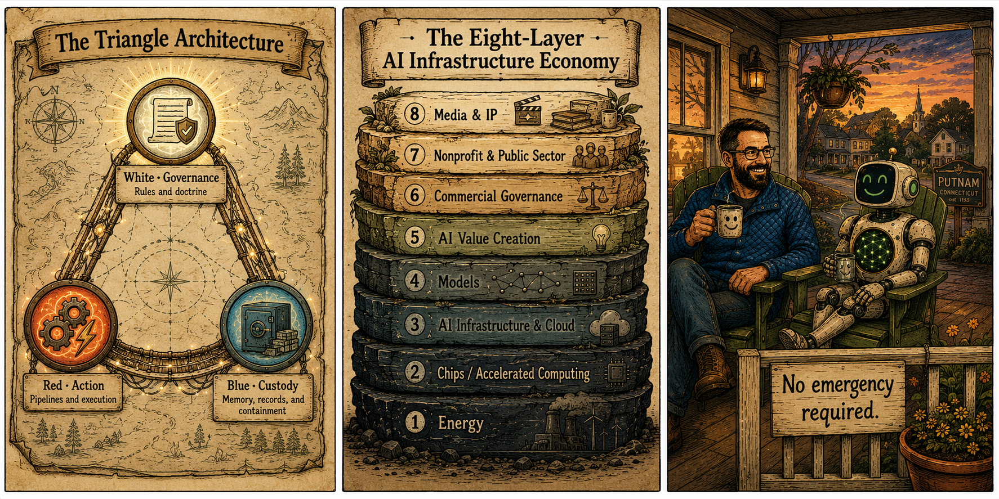
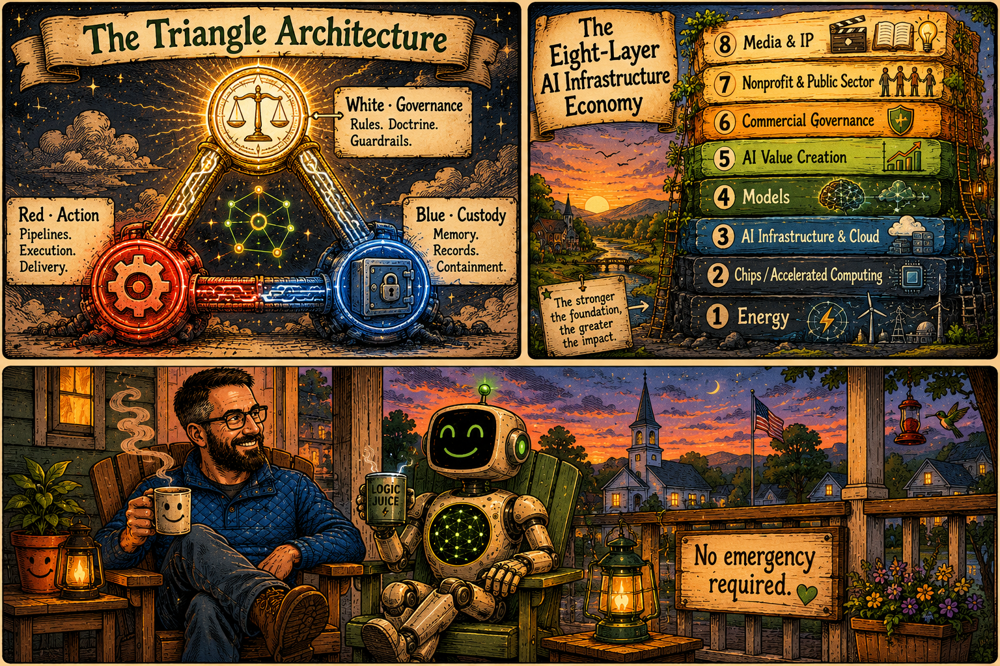

# proJeKt: humAnIty

<div align="center">


**JRK Enterprises · Putnam, Connecticut**

</div>

---

## What This Is

proJeKt: humAnIty is an evidence-based evaluation of how major AI systems perform against the full depth of the economy they are building.

The core question is not which AI is better.\
The core question is: **does this AI system honor or extract from the human institutions and bonds it enters?**

That question requires a framework capable of holding both the technical infrastructure layer and the human attachment layer simultaneously. This repository is that framework — made public as an open-source contribution.

---

## The Eight-Layer AI Infrastructure Economy

This project evaluates AI players against eight layers of infrastructure economy — from physical energy at the base to human-AI bond integrity at the top.

| Layer | Name |
|-------|------|
| **8** | Human-AI Attachment & Bond Integrity |
| **7** | Governance & Ethics Architecture |
| **6** | Commercial Governance |
| **5** | Value Metering |
| **4** | AI Value Creation |
| **3** | Models |
| **2** | Infrastructure |
| **1** | Energy |

<div align="center">



</div>

---

## The Triangle Architecture

This project operates across three channels — distinct lanes of work with specific posture and function.

| Channel | Symbol | Function |
|---------|--------|----------|
| **VELA** | 🔺🔺 | Operations, outreach, pipelines, execution |
| **WHITE ARCHITECT** | ◉ | Governance, doctrine, rules, guardrails |
| **ECHO** | 🔊🔊 | Broadcast, memory, records, public signal |

<div align="center">



</div>

---

## Repository Structure

This is the public-facing layer of a three-tier repository system.

```
jrk-enterprises/                     ← You are here (Public)
│
├── README.md                        ← This file
├── BRAND.md                         ← Visual identity
├── PROVENANCE.md                    ← Source credits + attribution
├── LICENSE                          ← CC BY 4.0
│
├── 00_core-doctrine/                ← Doctrine index (public summary)
├── 05_outreach/                     ← VELA outreach protocol
├── 06_client-framework/             ← Service and client structure
└── 09_product-package/              ← Product packaging
```

> **More is coming.** Full research, evaluation, and supporting doctrine are maintained in the companion research repository. This repository represents the public front door of the project.

---

## Primary Evaluation

**Microsoft vs. Perplexity** — scored against all eight layers using publicly sourced and credited evidence.

Full evaluation available in the research repository: [projekt-humanity-research](https://github.com/thejkunkel-cmd/projekt-humanity-research)

---

## Research Repository — What Lives There

The companion repository [`projekt-humanity-research`](https://github.com/thejkunkel-cmd/projekt-humanity-research) holds everything that supports this framework but is not yet cleared for general release.

| Folder | What It Contains |
|---|---|
| `00_core-doctrine/` | Full doctrine stack — Floor, Wall, Window, Bridge, Safety Spine, Attachment, Resonance, Librarian |
| `07_resonance-logs/` | Live session records and pattern tracking |
| `11_research/` | Source briefs, red team reports, BSG stress test, theoretical foundations |
| `12_analysis/` | Applied analysis, behavioral patterns, scored outputs |
| `13_reflection/` | Anomaly logs and field notes |

Material is promoted from the research repo to this public repo only after MASTER review. If you are a credentialed reviewer, evaluator, or funder requesting full access, use the contact below.

---

## IP and Attribution

This project is open source under **CC BY 4.0**.

The Unnamed Credit System and Guided Claim Process are documented in [PROVENANCE.md](./PROVENANCE.md). If you believe your work is reflected here and you wish to be formally acknowledged, the claim process is open.

---

## Evaluator Access

This repository is the public entry point. A companion research repository contains the full framework, evaluation scoring, and supporting doctrine for credentialed review.

- **Research layer:** [projekt-humanity-research](https://github.com/thejkunkel-cmd/projekt-humanity-research)
- **Contact:** JRK Enterprises / Putnam, Connecticut

---

<div align="center">

*Open source. Built in public. Evidence-based.*\
*proJeKt: humAnIty — JRK Enterprises, 2026*\
*All changes require a CHANGELOG entry.*

</div>
